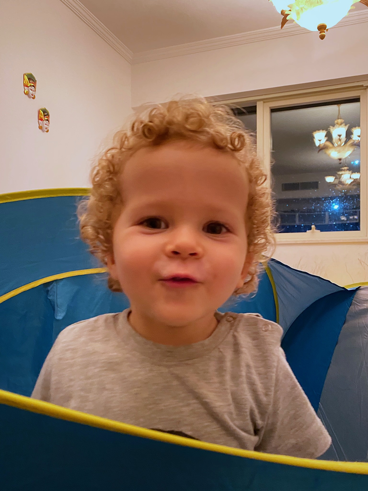

# Introduction {#intro}

## Oryx-MRSI 

Oryx-MRSI is a fully automated software for a comprehensive analysis of multi-slice proton magnetic resonance spectroscopic imaging (1H-MRSI) data. 

{width=50%}

{width=50%}

## Release 

Version 1.0

## Licencing 

Apache-2.0 License

## Developers

- Sevim Cengiz

- Muhammed Yildirim

- Abdullah Bas

- Esin Ozturk Isik

Should you publish material that made use of Oryx-MRSI, please cite the following publication:

Cengiz S, Yildirim M, Bas A, Ozturk-Isik E. ORYX-MRSI: A data analysis software for multi-slice 1H-MRSI. International Society for Magnetic Resonance in Medicine. Virtual Meeting, May 15-20, 2021.  (Digital Poster)

## Acknowledgements

- This project was funded by TUBITAK 115S219. We thank all open-source MR and MRS tools.

- Oryx-MRSI uses some functions of [FID-A](https://github.com/CIC-methods/FID-A), check [this link](https://github.com/CIC-methods/FID-A/blob/master/LICENSE.txt) for licence.

- Oryx-MRSI uses some functions of [Gannet](https://github.com/richardedden/Gannet3.1).

    - Edden RAE, Puts NAJ, Harris AD, Barker PB, Evans CJ. Gannet: A batch-processing tool for the quantitative analysis of gamma-aminobutyric acid-edited MR      spectroscopy spectra. J. Magn. Reson. Imaging 2014;40:1445–1452. doi: 10.1002/jmri.24478)

- Oryx-MRSI uses some functions of [Osprey](https://github.com/schorschinho/osprey), check [this link](https://github.com/schorschinho/osprey/blob/develop/LICENSE.md) for licence.

    - G Oeltzschner, HJ Zöllner, SCN Hui, M Mikkelsen, MG Saleh, S Tapper, RAE Edden. Osprey: Open-Source Processing, Reconstruction & Estimation of Magnetic Resonance Spectroscopy Data. J Neurosci Meth 343:108827 (2020).

- Oryx-MRSI uses some functions of [MRS_MRI_libs](https://github.com/chenkonturek/MRS_MRI_libs), check [this link](https://github.com/chenkonturek/MRS_MRI_libs/blob/master/LICENSE) for license.

- Oryx-MRSI uses some functionf of [NIFTI-Matlab](https://github.com/NIFTI-Imaging/nifti_matlab), check [this link](https://github.com/NIFTI-Imaging/nifti_matlab/blob/master/license.txt) for licence.

- Oryx-MRSI uses some functions written by [Jamie Near](https://www.mcgill.ca/psychiatry/jamie-near) (McGill University)

- Oryx-MRSI uses some functions written by [H.Ratiney](https://www.creatis.insa-lyon.fr/site7/en/users/ratiney) (CREATIS-LRMN) 

- Oryx-MRSI uses Schaefer2018_100/400Parcels_7Networks_order_FSLMNI152_2mm.nii. See Github [link](https://github.com/ThomasYeoLab/Standalone_CBIG_fMRI_Preproc2016), for [licence](https://github.com/ThomasYeoLab/Standalone_CBIG_fMRI_Preproc2016/blob/master/LICENSE.md).

- Oryx-MRSI uses MNI152_T1_2mm_brain.nii.gz, MNI-maxprob-thr0/25/50-2mm.nii.gz acquired from [FSL](https://fsl.fmrib.ox.ac.uk/fsl/fslwiki/Atlases), for [licence](https://fsl.fmrib.ox.ac.uk/fsl/fslwiki/Licence). 

- If there is any function that I forget to mention about name/link/citation, please let me know.

