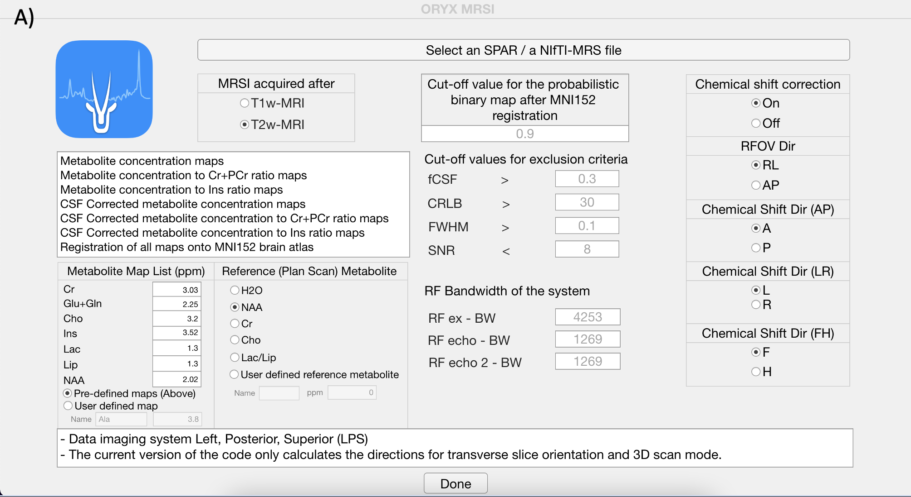
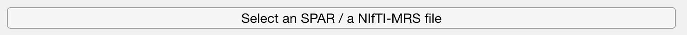
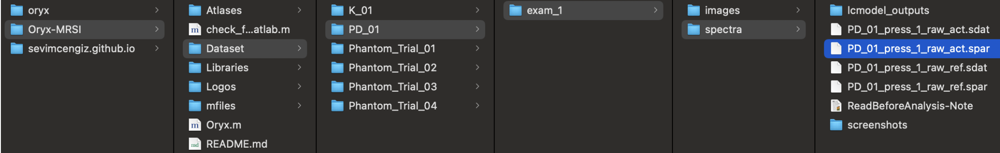
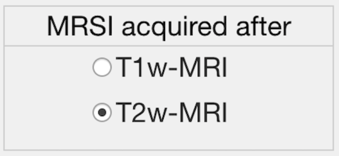
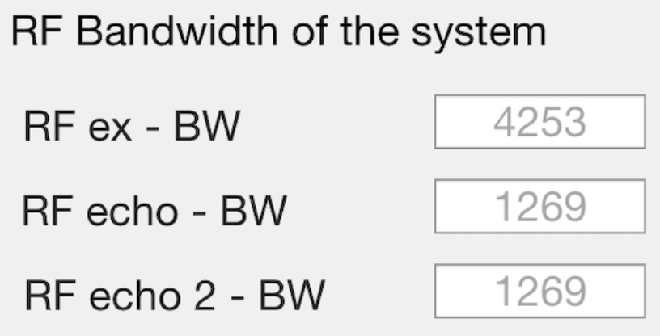
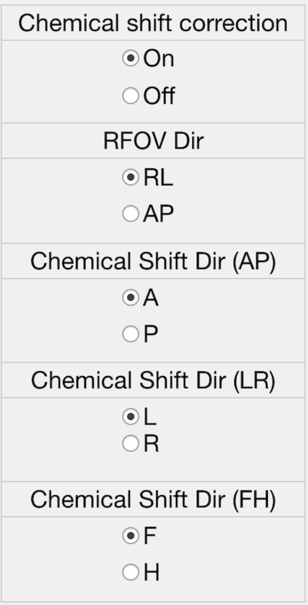
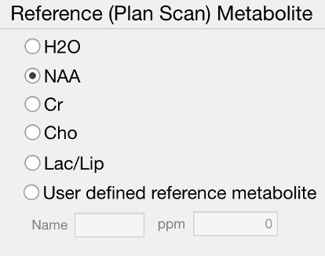
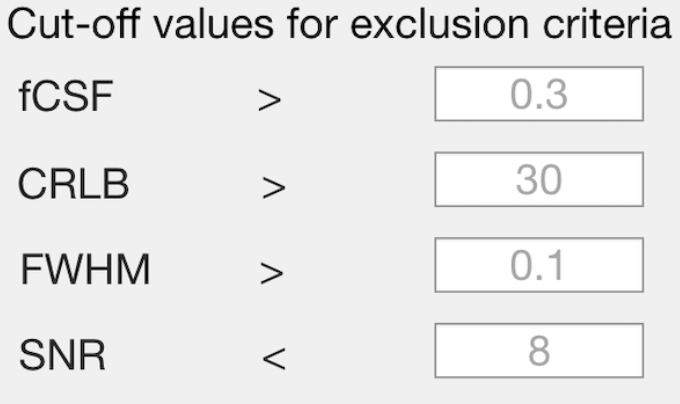
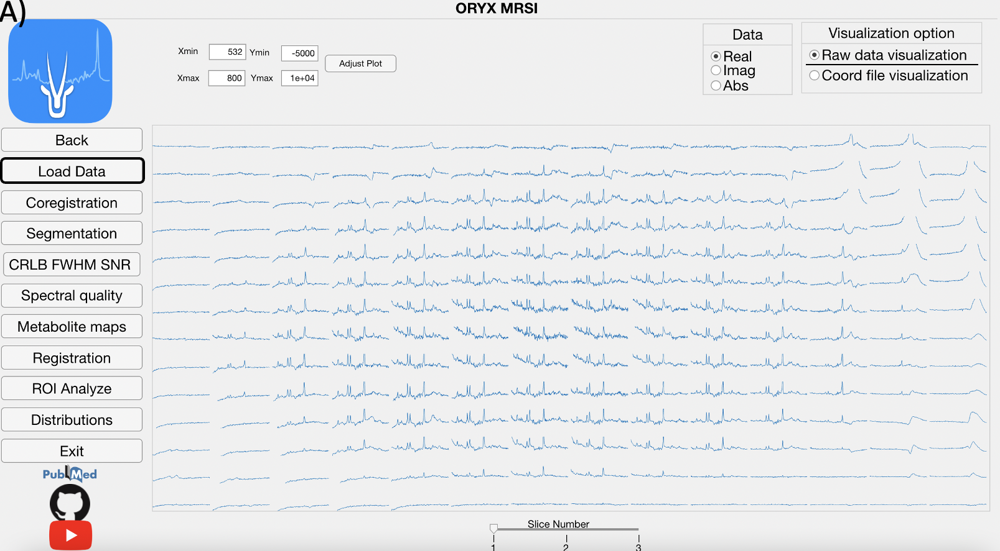

# Oryx-MRSI GUI Tutorial

This tutorial describes each step of the Oryx-MRSI analysis using the graphical user interface. We will learn how to start the GUI, select the spar file, select re- quirements information an the Main Gui Page and then Oryx-MRSI will enable us to use 8 different modules.

## Starting Oryx-MRSI

Please, make sure that SPM12 and ORYX-MRSI folders in the addpath with subfolders. 
(For more information, see this)

Please, make sure that FSL command can be used via Matlab and run check_fsl_usage_from_matlab.m (For more information, see this)

Let’s start with Oryx-MRSI. At the MATLAB prompt, enter

>> Oryx

It will display the Oryx-MRSI main Page.

{width=80%}

Selecting data and providing information.
Click the select .spar file button ,and open dataset folder under Oryx-MRSI repository in your drive.

Selecting data and providing information.
Click the select .spar file button ,and open dataset folder under Oryx-MRSI repository in your drive.

{width=80%}

Choose an example dataset or select your own dataset (Please, follow the steps at here link).

{width=80%}

Provide information for MRSI acquisition after T1w-MRI or T2w- MRI.

{width=40%}

Provide information for the chemical shift correction. (Recommended is ON if you have the system RF bandwidths information)

{width=40%}

If chemical shift correction is on, please provide information shown
in the figure.

{width=40%}

Please, select reference metabolite for chemical shift correction.

{width=50%}

Please, provide cut-off values for automated spectral quality.

{width=40%}

Please, provide cut-off value for the probabilistic binary map after MNI152 brain atlas registration.

{width=40%}

Please, click Done button.

Done

## Load Module

This module reads the raw 1H-MRSI data, LCModel .coord output files, and allows for a visualization of the spectra.

{width=40%}
