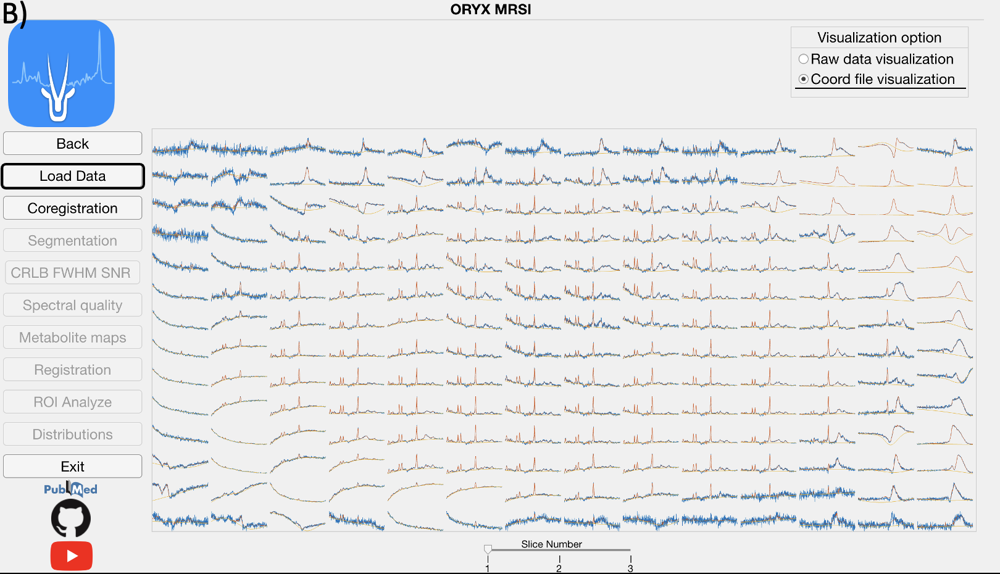
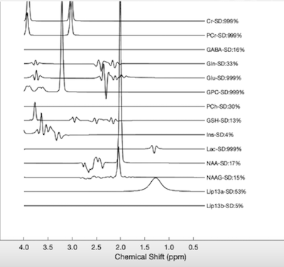
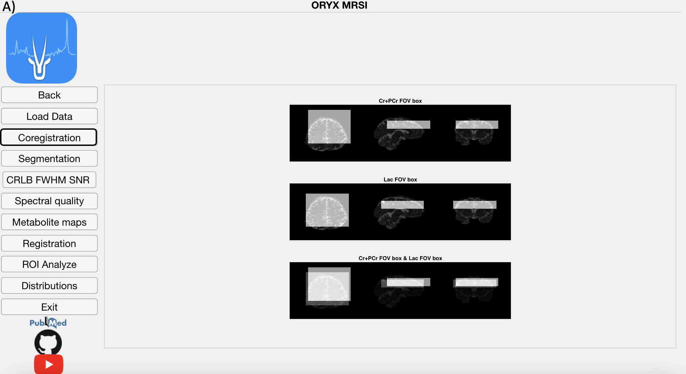
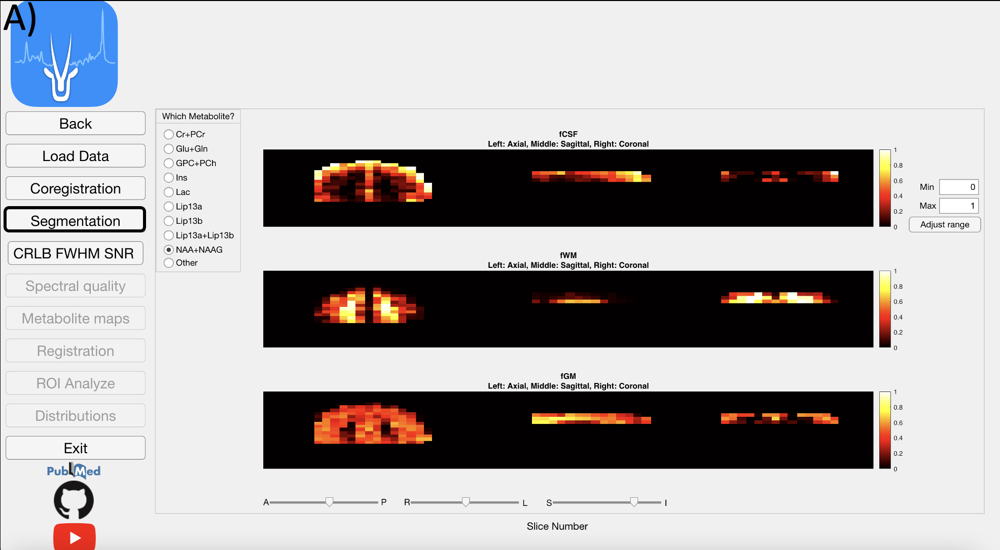
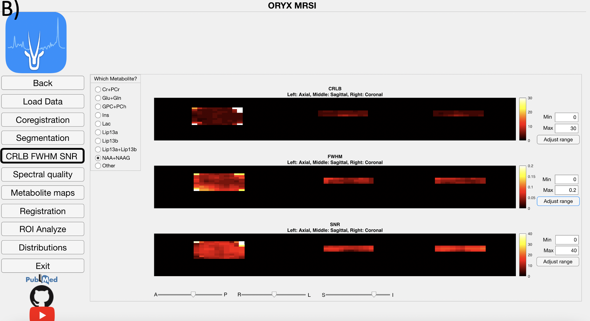
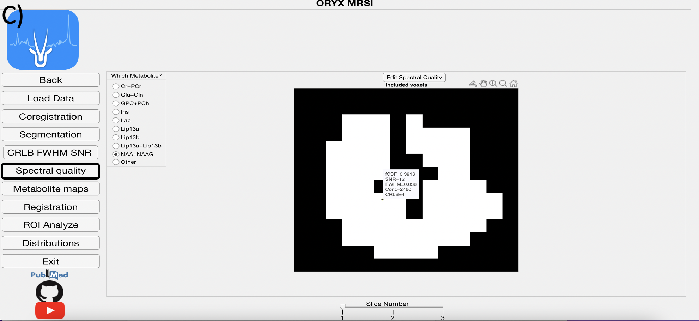
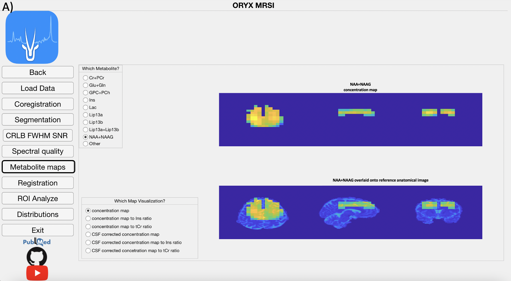

# Oryx-MRSI GUI Tutorial

This tutorial describes each step of the Oryx-MRSI analysis using the graphical user interface. We will learn how to start the GUI, select the spar file, select re- quirements information an the Main Gui Page and then Oryx-MRSI will enable us to use 8 different modules.

## Starting Oryx-MRSI

Please, make sure that SPM12 and ORYX-MRSI folders in the addpath with subfolders. 
(For more information, see this)

Please, make sure that FSL command can be used via Matlab and run check_fsl_usage_from_matlab.m (For more information, see this)

Let’s start with Oryx-MRSI. At the MATLAB prompt, enter

>> Oryx

It will display the Oryx-MRSI main Page.

{width=80%}

Selecting data and providing information.
Click the select .spar file button ,and open dataset folder under Oryx-MRSI repository in your drive.

Selecting data and providing information.
Click the select .spar file button ,and open dataset folder under Oryx-MRSI repository in your drive.

{width=80%}

Choose an example dataset or select your own dataset (Please, follow the steps at here link).

{width=80%}

Provide information for MRSI acquisition after T1w-MRI or T2w- MRI.

{width=30%}

Provide information for the chemical shift correction. (Recommended is ON if you have the system RF bandwidths information)

{width=30%}

If chemical shift correction is on, please provide information shown
in the figure.

{width=30%}

Please, select reference metabolite for chemical shift correction.

{width=30%}

Please, provide cut-off values for automated spectral quality.

{width=30%}

Please, provide cut-off value for the probabilistic binary map after MNI152 brain atlas registration.

{width=30%}

Please, click Done button.

Done

## Load Module

This module reads the raw 1H-MRSI data, LCModel .coord output files, and allows for a visualization of the spectra.

{width=80%}

{width=80%}

Click, for the magnification of the selected spectra.

{width=80%}

## Co-registration Module

If chemical shift correction is ON, then the chemical shift misregistration amount is calculated for each metabolite using the selected metabolite as the reference and RF pulse bandwidths for each direction provided on the Main Page. Then, a metabolic map is shifted into its respective location considering the MR image space data order. Afterwards, the field of view (FOV), the PRESS box, and each voxel within the FOV are co-registered onto anatomical MR image for each metabolite map followed by the visualization of the shifted metabolite maps.

{width=80%}

## Segmentation Module

After white matter (WM), gray matter (GM), and cerebrospinal fluid (CSF) are segmented from a T1-weighted MRI using SPM12, the module calculates the WM, GM and CSF fractions (fWM, fGM, and fCSF) in each voxel for every metabolite, which vary due to chemical shift misregistration.Figure shows the fCSF, fWM and fGM maps for a selected metabolite (NAA+NAAG) at one slice. This part might take 30 minutes.

{width=80%}

## FWHM & SNR Module

This module reads LCModel .table files to get FWHM and SNR values of each voxel to create and visualize multivoxel FWHM and SNR maps.

{width=80%}

## Spectral Quality Module

This module displays voxels included in the 1H-MRSI data analysis for each metabolite after the FWHM, SNR, CRLB, and fCSF exclusion criteria defined on the Main Page are applied.

{width=80%}

## Metabolite Map Module

The LCModel .table files are parsed using a text reader and each metabolite result is positioned into a 3D grid in accordance with the MR image space data to create several maps, which are the concentration, CSF corrected concentra- tion (C=C0*(1/(1-fCSF))), and concentration or CSF corrected concentration to Ins and Cr+PCr ratio maps. Currently, these maps are created for nine dif- ferent metabolites, which are Cr+PCr, Glu+Gln, GPC+PCh, Ins, Lac, Lip13a, Lip13b, Lip13a+Lip13b.

{width=80%}

## Registration Module

This modules registers the reference anatomical MRI onto MNI152 brain at- las using FMRIB’s Linear Image Registration Tool (FSL FLIRT) to obtain a transformation matrix. Then, this transformation matrix is used to register the PRESS box and all the concentration or ratio maps that were previously co-registered to the anatomical MRI onto the MNI152 brain atlas. The user pro- vides a cutoff value for the probabilistic maps, (at the main page), which are produced as a result of registration, and all the pixels that exceed this threshold are included in the data analysis.

{width=80%}

## ROI Analysis

The metabolic maps are currently evaluated at different brain regions to define a mean, median and standard deviation value of the concentration map of interest at these brain regions. A result is produced for a parcellation if only more than provided value at the ROI Analyze page% of its pixels are included within the metabolite map of interest.