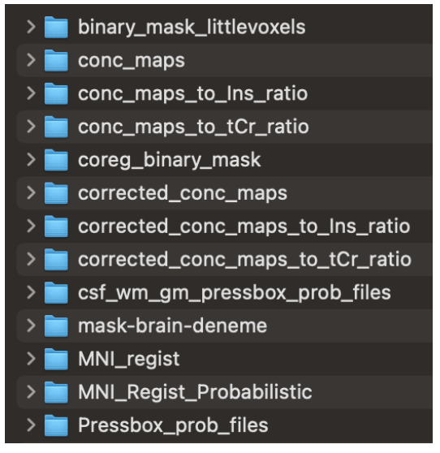
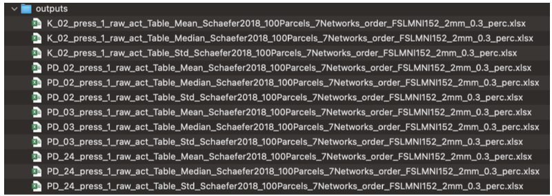

# Output Files

A folder named nifti will be created after the analysis. 

It includes all spectral volumes.

{width=80%}

FSLeyes link is suggested for nifti file visualization.

A folder named outputs will include all excell files after ROI Analysis.

{width=80%}

 
